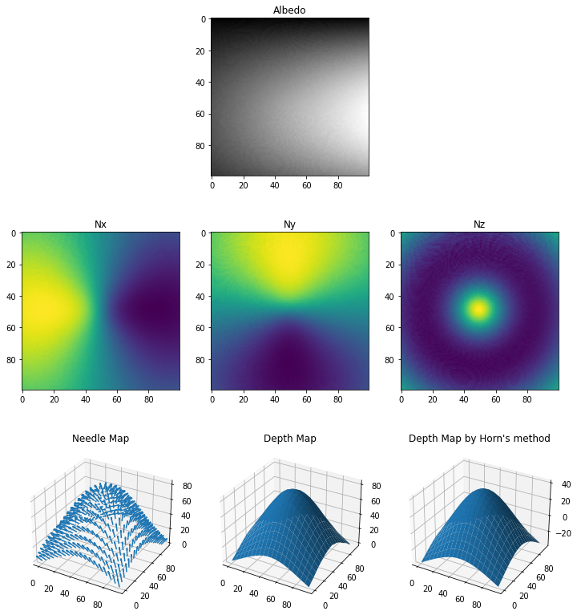
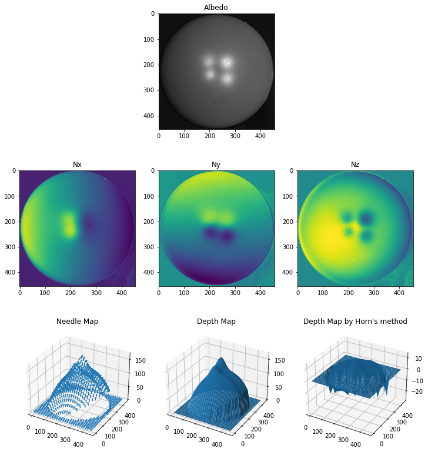
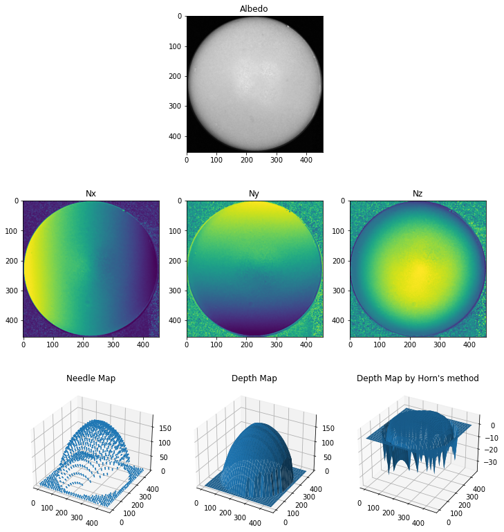

# Photometric Stereo

This notebook implements Surface estimation using Photometric Stereo. Refer notebook for notes and comments 

------------------------

## Synthetic Surface Estimation 

 

---------------------------

## Photometric Stereo - Sphere Surface Estimation using RGB Image 

 

---------------------------

## Robust Photometric Stereo - Sphere Surface Estimation using SUV color space image

 

 