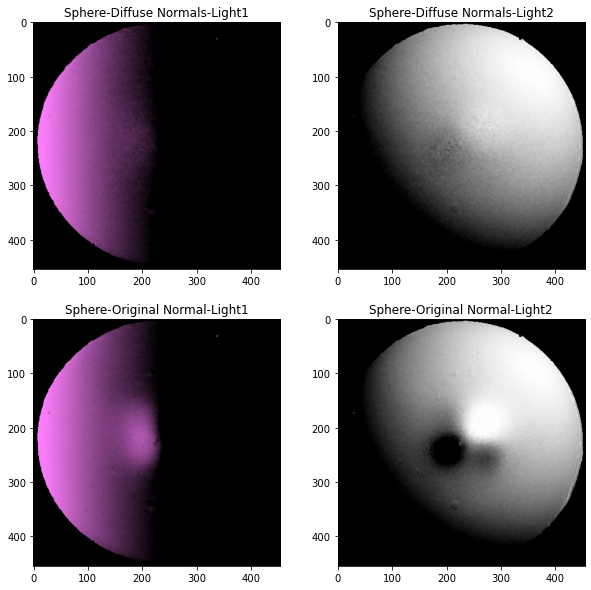
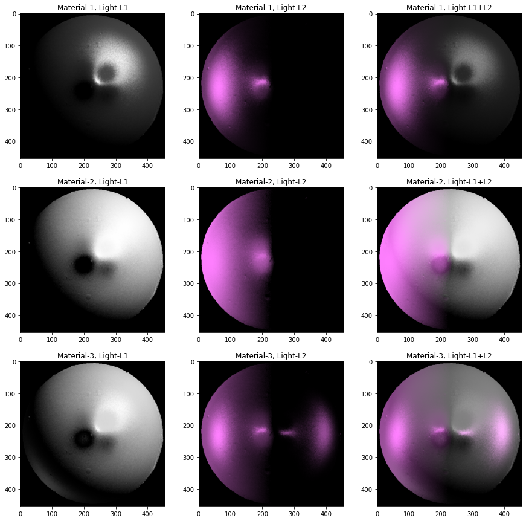
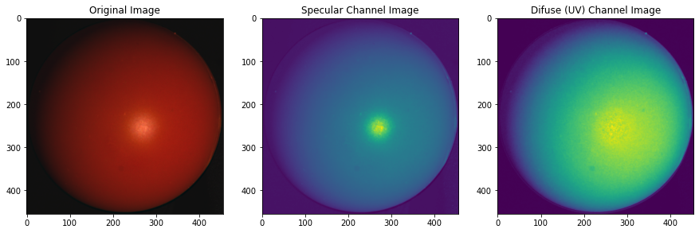

# Surface Rendering  

This notebook implements surface rendering program using Lambertian and Phong's Reflectance models. 

### Sphere Surface for Diffuse material - Lambertian Reflectance Model 

 

---------------------------

### Sphere Surface for Specular material - Phong's Reflectance Model 

 

---------------------------

## Specularity Removal

We implement the specularity removal technique described in *Beyond Lambert: Reconstructing Specular Surfaces Using Color* (by Mallick, Zickler, Kriegman, and Belhumeur; CVPR 2005). This paper rotates the RGB image channels to SUV image channels such that all the specular information is contained in the S channel. The S channel is aligned with the direction of light.

 

 